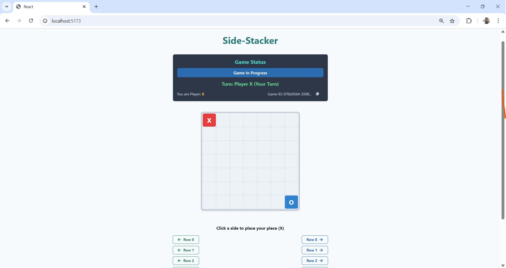
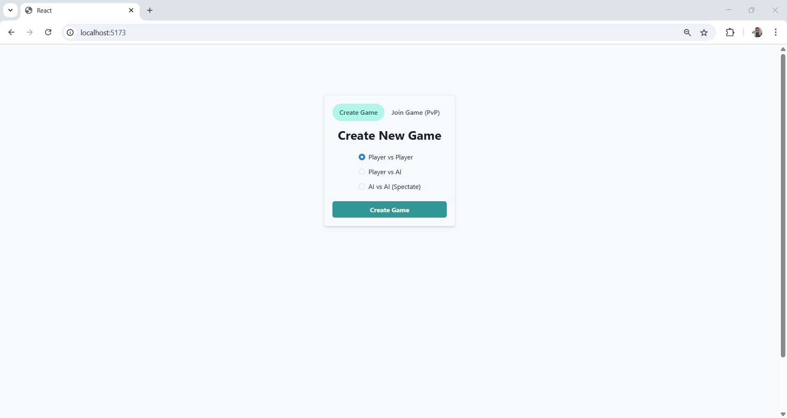
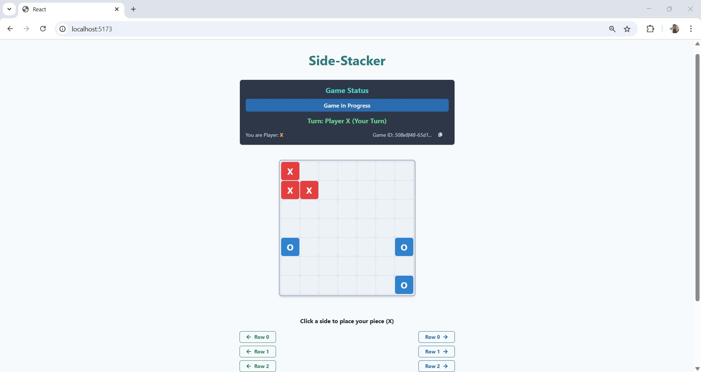
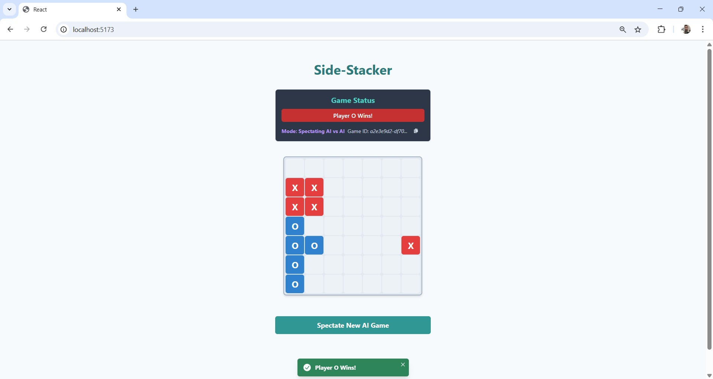

      
# Side-Stacker Game




## Table of Contents

- [Side-Stacker Game](#side-stacker-game)
  - [Table of Contents](#table-of-contents)
  - [Introduction](#introduction)
  - [Features](#features)
  - [Tech Stack](#tech-stack)
  - [Project Structure](#project-structure)
  - [Setup and Installation](#setup-and-installation)
    - [Prerequisites](#prerequisites)
    - [Running with Docker (Recommended)](#running-with-docker-recommended)
    - [Manual Setup (Alternative - More Complex)](#manual-setup-alternative---more-complex)
  - [How to Play](#how-to-play)
  - [Game Modes](#game-modes)
  - [Screenshots](#screenshots)
  - [Architectural Notes \& Refinements](#architectural-notes--refinements)
  - [Future Enhancements](#future-enhancements)
  - [Known Issues / Limitations](#known-issues--limitations)

## Introduction

Side-Stacker is a web-based, two-player strategy game similar to Connect Four, but with a twist: pieces are stacked from either side of the rows instead of being dropped from the top. The game is played on a 7x7 grid. Players (or AI opponents) take turns placing their pieces ('X' or 'O') into a chosen row from the left or right side. The piece stacks inwards from the chosen side into the first available empty cell in that row.

The game ends when:
- A player gets four of their pieces consecutively in a row (horizontally, vertically, or diagonally).
- The board is completely full, resulting in a draw.

This project implements real-time multiplayer gameplay using WebSockets, AI opponents with varying difficulty levels, and persists game state in a backend database.

## Features

- **Real-time Gameplay:** See opponent's moves instantly without page refresh using WebSockets.
- **Multiple Game Modes:**
    - **Player vs Player (PvP):** Play against another human player.
    - **Player vs AI (PvE):** Challenge an AI opponent.
        - Easy Difficulty
        - Medium Difficulty (Minimax-based)
        - Hard Difficulty (Enhanced Minimax)
    - **AI vs AI (AvA):** Spectate a game between two AI opponents.
- **Interactive UI:** Clean and user-friendly interface built with React and Chakra UI.
- **Persistent Game State:** Game progress is saved in a PostgreSQL database.
- **Responsive Design:** Basic responsiveness for enjoyable play on various screen sizes (primarily desktop-focused).
- **Dark Theme:** Easy-on-the-eyes dark theme for comfortable gameplay.

## Tech Stack

- **Frontend:**
    - React (with JavaScript)
    - Vite (Build tool & Dev Server)
    - Chakra UI (Component Library & Styling)
    - React State (State Management)
    - WebSockets (native browser API)
- **Backend:**
    - Python 3.9+
    - FastAPI (Web Framework)
    - Uvicorn (ASGI Server)
    - WebSockets (FastAPI native support)
    - SQLAlchemy (ORM for database interaction)
    - Alembic (Database Migrations)
    - Pydantic (Data Validation)
- **Database:**
    - PostgreSQL
- **Containerization:**
    - Docker
    - Docker Compose
- **AI:**
    - Rule-based (Easy)
    - Minimax with Alpha-Beta Pruning (Medium, Hard)
- **Code Formatting:**
    - Prettier (Frontend)
    - Black (Backend)
- **Version Control:**
    - Git & GitHub

## Project Structure

    

```text
side-stacker-game/
├── assets/                  # Screenshots and other static assets for README
├── backend/                 # FastAPI backend application
│   ├── app/                 # Core application logic
│   │   ├── api/             # API endpoints
│   │   │   └── v1/
│   │   │       └── endpoints/   # WebSocket (game_ws.py) and HTTP endpoints
│   │   ├── core/            # Configuration (config.py) and shared Constants (constants.py)
│   │   ├── crud/            # Database CRUD operations (crud_game.py)
│   │   ├── db/              # Database models, session, migrations (Alembic)
│   │   ├── schemas/         # Pydantic schemas for data validation & serialization
│   │   ├── services/        # Business logic
│   │   │   ├── ai/              # AI bot implementations (base_bot.py, easy_bot.py, etc.)
│   │   │   ├── ava_game_manager.py  # Logic for AI vs AI game loop
│   │   │   ├── game_logic.py       # Core game rules (moves, win/draw checks)
│   │   │   └── pve_game_manager.py # Logic for Player vs AI turns
│   │   └── websockets/      # WebSocket connection management (connection_manager.py)
│   ├── tests/               # Backend unit/integration tests
│   ├── alembic.ini
│   ├── Dockerfile
│   ├── pyproject.toml
│   └── requirements.txt
├── frontend/                # React frontend application
│   ├── public/              # Static assets served directly
│   ├── src/                 # Frontend source code
│   │   ├── assets/              # Images, fonts, etc. used by components
│   │   ├── components/          # Reusable UI components (Board, Controls, GameInfo, GameSetup)
│   │   │   ├── board/              # Board-specific components
│   │   │   └── views/              # Components representing distinct UI states/views of GamePage
│   │   ├── constants/           # Shared frontend constants (gameConstants.js)
│   │   ├── hooks/               # Custom React Hooks (useGameStateManager, useGameWebSocket)
│   │   ├── pages/               # Top-level page components (GamePage.jsx)
│   │   ├── services/            # API/WebSocket service layer (socketService.js)
│   │   ├── App.jsx
│   │   ├── main.jsx             # React application entry point with ChakraProvider
│   │   └── index.css            # Global CSS
│   ├── .env                   # Environment variables for frontend (ignored by git, use .env.example)
│   ├── .prettierrc.js
│   ├── Dockerfile
│   ├── index.html
│   ├── package.json
│   └── vite.config.js
├── .env                       # Root .env for docker-compose variables (if any)
├── .gitignore
├── DESIGN.MD                  # Project design document/notes
├── docker-compose.yml
└── README.md                  # This file
```

      
## Setup and Installation

### Prerequisites

- Docker and Docker Compose installed on your system.
  - [Install Docker Desktop](https://www.docker.com/products/docker-desktop/) (includes Docker Compose)
- Git (for cloning the repository)
- A modern web browser (Chrome, Firefox, Edge, Safari)

### Running with Docker (Recommended)

This is the simplest way to get the application running locally.

1.  **Clone the repository:**
    ```bash
    git clone https://github.com/<your-username>/side-stacker-game.git
    cd side-stacker-game
    ```

2.  **Create environment files (if they don't exist from the repo):**
    The backend requires a `.env` file. If it's not present, copy the example:
    ```bash
    cp backend/.env.example backend/.env
    ```
    The frontend can use `.env.development` for `VITE_WS_BASE_URL`. If not present:
    ```bash
    # Example: cp frontend/.env.development.example frontend/.env.development
    # Or create frontend/.env.development with:
    # VITE_WS_BASE_URL=ws://localhost:8000/api/v1/ws-game/ws 
    # (Adjust if your WebSocket path differs)
    ```
    *(Note: Ensure the `DATABASE_URL` in `backend/.env` points to `db:5432` as configured in `docker-compose.yml`)*

3.  **Build and run the Docker containers:**
    From the root of the project directory (`side-stacker-game/`), run:
    ```bash
    docker-compose up --build
    ```
    - The `--build` flag ensures images are built if they don't exist or if Dockerfiles have changed.
    - This will start the backend, frontend, and database services.
    - The first time you run this, it might take a few minutes to download base images and install dependencies.

4.  **Apply database migrations (if running for the first time or after model changes):**
    Open a new terminal window, navigate to the `backend` directory of the project, and run:
    ```bash
    cd backend
    docker-compose exec backend alembic upgrade head
    cd .. 
    ```
    *(This command needs to be run from the directory containing the `docker-compose.yml` if `backend` is not the context, or adjust the `docker-compose exec` command pathing. Simpler: from project root: `docker-compose exec backend alembic upgrade head`)*

5.  **Access the application:**
    - Frontend (Game): Open your browser to `http://localhost:5173`
    - Backend API Docs (Swagger UI): `http://localhost:8000/docs`

6.  **To stop the application:**
    Press `Ctrl+C` in the terminal where `docker-compose up` is running.
    To remove the containers (but keep volumes like DB data):
    ```bash
    docker-compose down
    ```
    To remove containers AND volumes (like database data - **use with caution**):
    ```bash
    docker-compose down -v
    ```

### Manual Setup (Alternative - More Complex)
*(Docker is the primary method, for setup and testing)*

1.  **Backend (Python/FastAPI):**
    - Create and activate a Python virtual environment.
    - Install dependencies: `pip install -r backend/requirements.txt`
    - Set up PostgreSQL database manually or ensure one is running.
    - Configure `backend/.env` with the correct `DATABASE_URL`.
    - Run database migrations: `cd backend; alembic upgrade head`
    - Run the FastAPI server: `cd backend; uvicorn app.main:app --reload`
2.  **Frontend (React/Vite):**
    - Install Node.js and npm/yarn.
    - Install dependencies: `cd frontend; npm install`
    - Create `frontend/.env.development` with `VITE_WS_BASE_URL` pointing to your backend.
    - Run the Vite dev server: `cd frontend; npm run dev`

## How to Play

1.  Navigate to the application in your browser (`http://localhost:5173`).
2.  You'll see the "Create New Game" setup screen.
3.  **Choose a Game Mode:**
    - **Player vs Player (PvP):**
        - Player 1 creates the game. The UI will show "Waiting for Player 2..." and a Game ID.
        - Player 2 (on another browser/tab, or a friend) will need the Game ID to join. 
    - **Player vs AI (PvE):**
        - Select "Player vs AI" and choose the AI difficulty (Easy, Medium, or Hard).
        - Click "Create Game". The game starts immediately with you as Player X.
    - **AI vs AI (AvA):**
        - Select "AI vs AI" and choose the difficulties for AI 1 (X) and AI 2 (O).
        - Click "Create Game". The game starts immediately, and you spectate.
4.  **Making a Move:**
    - The game board is a 7x7 grid.
    - When it's your turn, control buttons will appear next to each row (one for the left side, one for the right).
    - Click the button corresponding to the side of the row where you want to place your piece.
    - Your piece ('X' or 'O') will stack into the first available empty cell from that side in the chosen row.
5.  **Winning/Drawing:**
    - The first player to get **four** of their pieces in a consecutive line (horizontally, vertically, or diagonally) wins the game.
    - If the board becomes completely full and no player has won, the game is a draw.
6.  **Game Over:**
    - A message will indicate the winner or if it's a draw.
    - A "Play Again (New Game)" button will appear to start a new setup.

## Game Modes

- **Player vs Player (PvP):** Two human players compete against each other in real-time.
- **Player vs AI (PvE):** A human player competes against an AI opponent.
    - **Easy AI:** Makes semi-random moves with basic win/block logic.
    - **Medium AI:** Uses the Minimax algorithm with a moderate search depth and heuristics.
    - **Hard AI:** Uses Minimax with a deeper search depth and a more sophisticated heuristic function for stronger play.
- **AI vs AI (AvA) (Spectator Mode):** Watch two AI opponents play against each other. You can choose the difficulty levels for both AIs.

## Screenshots


1.  **Game Setup Screen:**
    
    *(Description: Shows the initial screen where the user selects game mode (PvP, PvE, AvA) and AI difficulties.)*

2.  **Player vs Player (PvP) - In Progress:**
    
    *(Description: A mid-game view of a PvP match, showing the board, pieces, game info, and controls for the current player.)*

3.  **Player vs AI (PvE) - Medium AI - Player's Turn:**
    
    *(Description: Player X's turn against the Medium AI. Shows the board state and controls enabled for the player.)*

4.  **AI vs AI (AvA) - Spectating:**
    
    *(Description: Spectating an AI vs AI game. Shows the board updating automatically as AIs make moves. No controls are visible for the spectator.)*

5.  **Game Over - Player Win:**
    
    *(Description: The game over screen showing Player X (or O) as the winner, the final board state, and the "Play Again" button.)*

## Architectural Notes & Refinements

This project has undergone significant refactoring to improve code quality, maintainability, and adherence to software engineering principles:

- **Backend Modularity:**
    - The main WebSocket endpoint (`game_ws.py`) now acts as a dispatcher, delegating message processing to dedicated handler functions (e.g., `handle_create_game_message`, `handle_join_game_message`, `handle_make_move_message`).
    - Complex game mode logic, such as the AI vs AI game loop (`ava_game_manager.py`) and AI turns in PvE games (`pve_game_manager.py`), has been extracted into separate service modules. This promotes the Single Responsibility Principle (SRP).
    - `ConnectionManager` has been enhanced to map `client_id` to `WebSocket` instances within each game room, enabling reliable targeted messaging and simplified client tracking. Helper methods for common broadcast patterns (e.g., game updates, errors, game over) have been added.
    - A centralized `constants.py` file is used for shared values like message types, game statuses, and payload keys, reducing magic strings and improving consistency.
- **Frontend Modularity:**
    - The main `GamePage.jsx` component has been refactored to utilize custom React hooks:
        - `useGameWebSocket`: Encapsulates WebSocket connection setup, message sending, and initial reception.
        - `useGameStateManager`: Manages core game state (`gameData`, `gameState`), loading/error states, and state update logic triggered by WebSocket events.
    - UI rendering for different game phases (connecting, error, waiting, active play) has been broken down into distinct view components (e.g., `ConnectingToServerView.jsx`, `MainGamePlayView.jsx`), making `GamePage.jsx` primarily a view controller.
    - A shared `gameConstants.js` file is used on the frontend for similar benefits as its backend counterpart.

These refinements aim for a codebase that is easier to understand, test, debug, and extend, aligning with practices common in professional software development.


## Future Enhancements

- **Improved Visual Feedback:**
    - Highlight valid move spots on hover.
    - Animate piece placement and winning lines.
- **User Authentication & Profiles:** Accounts, stats, persistent identities.
- **Matchmaking / Lobby System.**
- **More Advanced AI:** Transposition tables, MCTS, or even small ML models for board evaluation.
- **Full Spectator Mode:** Allow watching any ongoing PvP/PvE game.
- **Game Replay Feature.**
- **UI/UX Polish:** Light/dark mode toggle, enhanced styling.
- **Robust Player Disconnect Handling:** More graceful game state updates when a player disconnects mid-game (e.g., opponent wins by forfeit).
- **Unit & Integration Tests:** Expanded test coverage for both frontend and backend.

## Known Issues / Limitations

- **AI Performance (Hard):** The Hard AI can experience noticeable delays on complex board states due to deeper Minimax search.
- **AvA Game Start:** Currently starts automatically; a manual "Start" button for spectators could be added.
- **Error Handling:** While improved, can be further enhanced with more specific user feedback for certain edge cases.
- **Scalability:** The current `ConnectionManager` (single instance) is suitable for a moderate number of concurrent games on a single server instance. For very high scalability, a distributed solution (e.g., using Redis Pub/Sub with multiple backend instances) would be necessary.